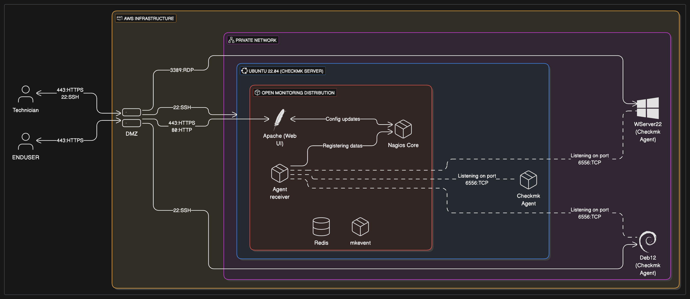

# System Requirements

This document outlines the hardware and software requirements for our CheckMk monitoring implementation, with justification for each choice based on official support and best practices.

## Architecture Overview

Our CheckMk monitoring solution is deployed on AWS infrastructure with the following architecture:

The architecture consists of:

- **DMZ Server**: Entry point for external access (HTTPS/SSH)
- **CheckMk Server**: Ubuntu 22.04 running CheckMk with integrated components
- **Monitored Hosts**: Debian 12 and Windows Server 2022 with CheckMk agents
- **Communication**: Secure connections via SSH, RDP, and CheckMk agent protocol (port 6556)

## CheckMk Server Requirements

### Hardware Specifications

| Component | Minimum Requirement (100 hosts) | Our Setup       | Justification                                                                  |
| --------- | ------------------------------- | --------------- | ------------------------------------------------------------------------------ |
| CPU       | 2 cores, 2.0GHz                 | 2 cores, 2.0GHz | Sufficient for monitoring only 2 hosts in our deployment.                      |
| RAM       | 8 GB                            | 4 GB            | Minimum requirement is adequate for our small deployment with only 2 hosts.    |
| Storage   | 120 GB SSD                      | 20 GB           | Minimum storage is sufficient for small deployment with limited logs and data. |

[Recommended system resources](https://checkmk.com/product/checkmk-system-requirements)

### Software Requirements

| Software      | Version   | Justification                                                                                                                                                                                 |
| ------------- | --------- | --------------------------------------------------------------------------------------------------------------------------------------------------------------------------------------------- |
| Ubuntu Server | 22.04 LTS | Most Checkmk support and documentation is for 22.04. Version 24.04 is only recently supported (since late 2024), so 22.04 is preferred for stability and compatibility. See screenshot below. |
| CheckMk       | 2.4.0     | Latest stable version with all required features and security updates.                                                                                                                        |

## Supported OS Versions

_Ubuntu 22.04 is the most widely supported LTS version as of May 2025. Ubuntu 24.04 support was only added between August 2023 and November 2024._

## Monitored Hosts Requirements

### Debian Host

| Component | Specification     | Notes                                      |
| --------- | ----------------- | ------------------------------------------ |
| OS        | Debian 12         | Officially supported by Checkmk 2.4.0      |
| Agent     | CheckMk Agent 2.4 | Compatible with our CheckMk server version |

### Windows Host

| Component | Specification       | Notes                                      |
| --------- | ------------------- | ------------------------------------------ |
| OS        | Windows Server 2022 | Officially supported by Checkmk 2.4.0      |
| Agent     | CheckMk Agent 2.4   | Compatible with our CheckMk server version |

## Network Requirements

| Requirement          | Configuration                                         |
| -------------------- | ----------------------------------------------------- |
| Firewall Access      | TCP port 80/443 for web interface                     |
|                      | TCP port 6556 for CheckMk agents                      |
| Network Connectivity | All hosts must be able to reach the monitoring server |

## Version Selection Rationale

### Why CheckMk 2.4.0?

- Latest stable version with enhanced security features
- Bug fixes from previous versions
- Compatible with our monitored systems

### Why Ubuntu Server 22.04?

- Most widely supported LTS version for Checkmk as of May 2025
- Long-term support (until 2027)
- Extensive documentation and community support
- Ubuntu 24.04 support is very recent (added between August 2023 and November 2024), so 22.04 is preferred for stability
